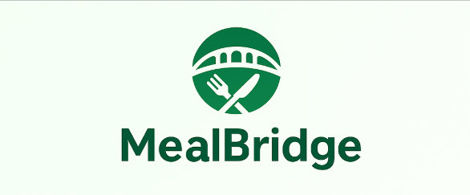

<p align="center">
  
</p>

<h1 align="center">🍽️ MealBridge</h1>
<h3 align="center">Empower Communities • Feed the Needy • Reduce Food Waste</h3>

<p align="center">
  <a href="#-about-the-project">About</a> • 
  <a href="#-features">Features</a> • 
  <a href="#-tech-stack">Tech Stack</a> • 
  <a href="#-installation--setup">Installation</a> • 
  <a href="#-screenshots">Screenshots</a> • 
  <a href="#-contributing">Contributing</a> • 
  <a href="#-license">License</a>
</p>

---

## 📌 About the Project

**MealBridge** is a full-stack MERN platform that connects **donors**, **NGOs**, and **volunteers** to optimize the collection and distribution of surplus food.

Together, we aim to:
- ♻️ **Reduce food wastage**
- 🤝 **Bridge the gap** between food surplus and hunger
- 🚛 **Streamline donation delivery**

---

## 🚀 Live Demo

🔗 [Click to Visit MealBridge](https://mealbridge.vercel.app)

---

## ✨ Features

✅ **Role-based authentication**
- Donor / NGO / Volunteer access
- Google Sign-In supported

📦 **Donor Dashboard**
- Create, edit, clone, and manage donations
- Auto-location fill using OpenCage
- Link donations to NGO requests

🏥 **NGO Dashboard**
- Request food with urgency & date
- Edit, delete, and duplicate requests
- Track request status: _Pending → Accepted → Completed_

🚗 **Volunteer Dashboard**
- View nearby donations on a map
- Filter by distance, food type, urgency, time slot
- Accept pickups, get optimized routes, submit feedback

📍 **Smart Filtering & Location Awareness**
- Auto-detect user location
- Show distance and route to donor
- Route planning via Leaflet Routing Machine

🗺️ **Interactive Map Interface**
- Separate NGO-tagged & general donations
- Color-coded markers and donation filters

💬 **Feedback System**
- Volunteers submit ratings and comments after delivery
- Feedback stored and linked to donations

---

## 🛠️ Tech Stack

### 👨‍💻 Frontend:
- React.js + React Router
- Tailwind CSS
- Google OAuth (`@react-oauth/google`)

### 🧠 Backend:
- Node.js + Express.js
- MongoDB with Mongoose
- JWT Authentication

### ☁️ Deployment:
- **Frontend**: Vercel  
- **Backend**: Render  
- **Database**: MongoDB Atlas

---

## 🔧 Installation & Setup

### 1. Clone the Repository

```bash
git clone https://github.com/your-username/foodsaver.git
cd foodsaver
```

### 2. Backend Setup
```bash
cd backend
npm install
```
Create a `.env` file:
```env
PORT=5000
MONGO_URI=your_mongo_connection_string
JWT_SECRET=your_secret_key
```
Start the backend server:
```bash
npm start
```

### 3. Frontend Setup
```bash
cd ../frontend
npm install
```
Create a `.env` file:
```env
REACT_APP_BACKEND_URL=https://foodsaver.onrender.com
```
Start the frontend app:
```bash
npm start
```

---

## 📸 Screenshots (Optional)

<!--> Add screenshots to the `screenshots/` folder and uncomment below:-->

<!--
### 🔒 Login Page


### 👤 Donor Dashboard


### 🏥 NGO Dashboard


### 🚗 Volunteer Dashboard

-->

---

## 🙌 Contributing

We welcome contributions! Follow the steps below:

1. Fork the repository
2. Create your branch: `git checkout -b feature-name`
3. Make your changes and commit: `git commit -m 'feature added'`
4. Push to the branch: `git push origin feature-name`
5. Create a Pull Request

---

## 📝 License

This project is licensed under the **MIT License**. Feel free to use and adapt!

---

> ✨ "Turning Food Waste into Hope - One Click at a Time"
